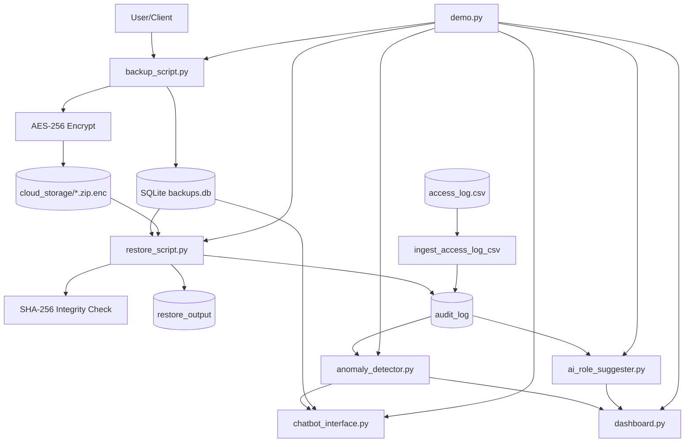

# SECURE_CLOUD_BACKUPS

Secure backup-and-restore prototype with encryption, integrity checks, access control, audit logging, analytics modules, and an end-to-end demo.

## Features

- AES-256 encrypted backups (`utils/crypto.py`)
- SHA-256 integrity validation (`utils/integrity.py`)
- RBAC + ABAC enforcement for restore operations (`utils/db_utils.py`, `scripts/restore_script.py`)
- Audit logging in SQLite (`data/backups.db`) and CSV ingestion (`scripts/anomaly_detector.py`)
- AI-style role suggestion engine (`scripts/ai_role_suggester.py`)
- Anomaly detection (`scripts/anomaly_detector.py`)
- Dashboard summary (`scripts/dashboard.py`)
- Chatbot-like command interface (`scripts/chatbot_interface.py`)
- Scalability test with large synthetic logs (`scripts/scalability_test.py`)
- Full integration workflow (`demo.py`)

## Project Structure

- `data/` → backups DB, CSV datasets, generated reports, backup artifacts
- `scripts/` → backup/restore and analytics modules
- `utils/` → crypto, integrity, DB utility logic
- `demo.py` → full orchestration

## Requirements

Minimum (current code):
- Python 3.10+
- `cryptography`
- `SCB_AES_KEY` environment variable set to a 32-character key (demo auto-generates ephemeral key when unset)

Optional for advanced visual/ML enhancements:
- `pandas`
- `scikit-learn`
- `matplotlib`
- `streamlit`

## Run End-to-End Demo

```bash
python demo.py
```

## Typical Demo Output (Sample)

```text
=== SECURE CLOUD BACKUPS DEMO START ===
Ingested 800 access-log records into SQLite audit_log
Created backup -> id=B20260510173015, checksum=0d3d...e9b
Restore status for B20260510173015: SUCCESS
Role suggestions generated: 100 (changes recommended: 17)
Anomalies detected: 121 from 800 events
Dashboard summary: {'backups_total': 1, 'audit_events_total': 802, 'restores_total': 1, 'denied_events_total': 1, 'anomalies_total': 121}
Chatbot sample responses:
- Commands: help | status <backup_id> | suggest_role <user_id> | anomalies
- Backup B20260510173015: user=U005, version=1, size=232, restore_count=1
- U005: current=Owner, suggested=Owner (denied_rate=0.0, reason=Role is consistent with observed behavior)
- Anomalies: 121 out of 800 events
Scalability test: {'event_count': 5000, 'anomalies': 703, 'elapsed_seconds': 0.0317, 'events_per_second': 157728.7}
=== SECURE CLOUD BACKUPS DEMO COMPLETE ===
```

## Architecture Diagram



## Viva Notes (Quick Explainers)

- **Role suggestion module**: behavior-driven heuristic recommender that compares denied/allowed access patterns and suggests least-privilege role adjustments.
- **Anomaly detector**: flags high denied attempts, broad backup access, repeated denied deletes, and risky personal-device restores.
- **Dashboard**: summarizes operational and security KPIs from SQLite + anomaly report.
- **Chatbot**: simple natural command wrapper for operational queries (`status`, `suggest_role`, `anomalies`).
- **Scalability test**: generates larger access logs and measures anomaly detection throughput.
